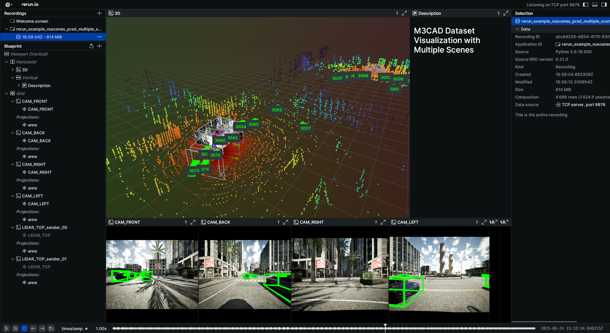

<h1 align="center">M3CAD: Towards Generic Cooperative Autonomous Driving Benchmark</h1>

<p align="center">
  <a href="https://arxiv.org/abs/2505.06746"></a>
  <a href="https://zhumorui.github.io/m3cad/"></a>
  <a href="https://drive.google.com/drive/u/1/folders/1tsuc7tJ9I8G1CWkh3G1ksOKbindNJtlt"></a>
  <a href="https://github.com/ZhuMorui/M3CAD/blob/main/LICENSE"></a>
</p>

https://private-user-images.githubusercontent.com/54446407/452126579-086f8291-e08a-4d7c-8204-1c84389ae23f

## Overview
M³CAD is currently the most comprehensive benchmark for both single-vehicle and cooperative autonomous driving research, supporting multiple tasks like object detection and tracking, mapping, motion forecasting, occupancy, and path planning, while supporting more realistic vehicle movements and interactions in complex environments.

## 📢 Changelog

### [2025-09-08] - Multi-Camera Dataset Support
- ✅ **Released 6-camera dataset** with layout identical to nuScenes setup to validate the model on real-world challenges.
- ✅ **Provided replay scripts** with customizable camera positions and additional sensor support.

## 🚀 Getting Started

This project follows the structure of [Bench2DriveZoo](https://github.com/Thinklab-SJTU/Bench2DriveZoo) and extends it to support cooperative autonomous driving tasks.

- [Installation](docs/INSTALL.md)
- [Data Preparation](docs/DATA_PREP.md)
- [Training and Evaluation](docs/TRAIN_EVAL.md)


## 📊 Results Visualization

We provide two visualization tools for both single-vehicle and cooperative autonomous driving tasks. 

1. Basic Visualization (BEV)
```bash
python m3cad/uniad/analysis_tools/visualize/run.py \
    --dataroot data/m3cad_carla_ue5 \
    --version v1.0-test \
    --predroot output/results.pkl \
    --out_folder output_vis \
    --demo_video output.mp4 \
    --project_to_cam # optional
```

2. We extend [Rerun Example](https://github.com/rerun-io/rerun/tree/docs-latest/examples/python/nuscenes_dataset) to visualize M3CAD dataset including lidar, images, ground truth bounding boxes and predicted bounding boxes in 3D space.

Make sure you have installed rerun-sdk by `pip install rerun-sdk`.


```bash
python m3cad/uniad/analysis_tools/visualize/rerun_visualizer.py \
    --root-dir data/m3cad_carla_ue5 \
    --scene-name '2025_06_24_18_33_22_60', '2025_06_24_18_33_22_51', '2025_06_24_18_33_22_75'  \ # support multiple scenes
    --serve \ 
    --dataset-version v1.0-test \
    --seconds 20 
```

## TODO
- [ ] support VAD
- [ ] support UniV2X

## 📬 Contact

For questions, feedback, or collaborations, feel free to contact:

- **Morui Zhu**: [moruizhu@my.unt.edu](mailto:moruizhu@my.unt.edu)  
- **Qing Yang**: [Qing.Yang@unt.edu](mailto:Qing.Yang@unt.edu)

## 🙏 Citation 

If you find this work useful in your research, please consider citing our paper:

```bibtex
@misc{zhu2025m3cad,
      title={M3CAD: Towards Generic Cooperative Autonomous Driving Benchmark}, 
      author={Morui Zhu and Yongqi Zhu and Yihao Zhu and Qi Chen and Deyuan Qu and Song Fu and Qing Yang},
      year={2025},
      eprint={2505.06746},
      archivePrefix={arXiv},
      primaryClass={cs.RO}
}
```

## Acknowledgements

We thank the authors of the following repositories for their contributions to this project:
* [Bench2DriveZoo](https://github.com/Thinklab-SJTU/Bench2DriveZoo)
* [UniAD](https://github.com/OpenDriveLab/UniAD)
* [OpenCOOD](https://github.com/DerrickXuNu/OpenCOOD)
* [NuScenes](https://github.com/nutonomy/nuscenes-devkit)
* [F-COOPER](https://github.com/Aug583/F-COOPER)
